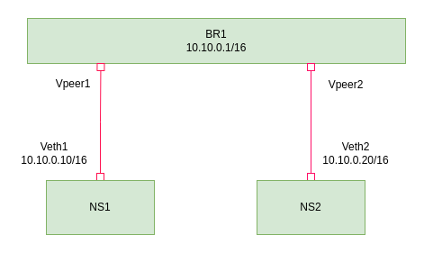
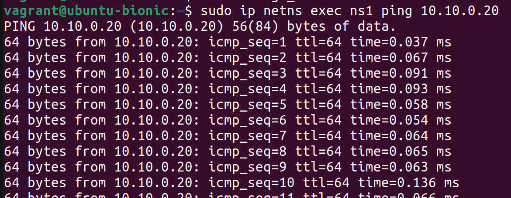

# Network Namespace and Bridge Configuration

This guide provides step-by-step instructions for setting up network namespaces and a bridge interface using the `ip` command-line tool.

# Architecture diagram




# Setup env
Initialize Vagrant with Ubuntu Bionic64 box
```bash
# Initialize Vagrant
vagrant init ubuntu/bionic64

# Start the virtual machine
vagrant up

# Connect to the virtual machine
vagrant ssh
```

# Setting up Two Network Namespaces Connected with a Bridge (br1)
To create two network namespaces (ns1 and ns2) connected with a bridge (br1), follow the steps outlined below:

# Create the network namespaces:
```bash
sudo ip netns add ns1
sudo ip netns add ns2
```
These commands create two network namespaces named "ns1" and "ns2".

# Create virtual Ethernet pairs (veth) and link them:
```bash
sudo ip link add veth1 type veth peer name vpeer1
sudo ip link add veth2 type veth peer name vpeer2
```

These commands create two pairs of virtual Ethernet devices, veth1-vpeer1 and veth2-vpeer2.

# Bring up the network interfaces:
``` bash
sudo ip link set veth1 up
sudo ip link set veth2 up
sudo ip link set vpeer1 up
sudo ip link set vpeer2 up
```
These commands bring up the network interfaces veth1, veth2, vpeer1, and vpeer2.

# Move the virtual Ethernet devices to their respective network namespaces:
```bash
sudo ip link set veth1 netns ns1
sudo ip link set veth2 netns ns2
```

These commands move the veth1 device to the "ns1" namespace and the veth2 device to the "ns2" namespace.

# Set up the network interfaces within the namespaces:
```bash
sudo ip netns exec ns1 ip link set veth1 up
sudo ip netns exec ns2 ip link set veth2 up
```

These commands bring up the network interfaces veth1 and veth2 within their respective namespaces.

# Assign IP addresses to the network interfaces within the namespaces:
```bash
sudo ip netns exec ns1 ip addr add 10.10.0.10/16 dev veth1
sudo ip netns exec ns2 ip addr add 10.10.0.20/16 dev veth2
```

These commands assign IP addresses to the veth1 interface in the "ns1" namespace (10.10.0.10/16) and to the veth2 interface in the "ns2" namespace (10.10.0.20/16).

# Create and configure a bridge:
```bash
sudo ip link add br1 type bridge
sudo ip link set br1 up
sudo ip link set vpeer1 master br1
sudo ip link set vpeer2 master br1
sudo ip addr add 10.10.0.1/16 dev br1
```

These commands create a bridge named "br1", bring it up, assign the vpeer1 and vpeer2 interfaces as its members, and assign an IP address (10.10.0.1/16) to the bridge.

# Test connectivity between the namespaces:
```bash
sudo ip netns exec ns1 ping 10.10.0.20
sudo ip netns exec ns2 ping 10.10.0.10
```
These commands verify connectivity by initiating ICMP ping requests from the "ns1" namespace to the IP address 10.10.0.20 (located in the "ns2" namespace) and vice versa.

## Screenshoot




## All are in one's

```bash
#!/bin/bash

# Create network namespaces
sudo ip netns add ns1
sudo ip netns add ns2

# Create virtual Ethernet pairs
sudo ip link add veth1 type veth peer name vpeer1
sudo ip link add veth2 type veth peer name vpeer2

# Bring up network interfaces
sudo ip link set veth1 up
sudo ip link set veth2 up
sudo ip link set vpeer1 up
sudo ip link set vpeer2 up

# Move virtual Ethernet devices to namespaces
sudo ip link set veth1 netns ns1
sudo ip link set veth2 netns ns2

# Bring up network interfaces within namespaces
sudo ip netns exec ns1 ip link set veth1 up
sudo ip netns exec ns2 ip link set veth2 up

# Assign IP addresses to interfaces within namespaces
sudo ip netns exec ns1 ip addr add 10.10.0.10/16 dev veth1
sudo ip netns exec ns2 ip addr add 10.10.0.20/16 dev veth2

# Create and configure bridge
sudo ip link add br1 type bridge
sudo ip link set br1 up
sudo ip link set vpeer1 master br1
sudo ip link set vpeer2 master br1
sudo ip addr add 10.10.0.1/16 dev br1

# Test connectivity between namespaces
sudo ip netns exec ns1 ping 10.10.0.20
sudo ip netns exec ns2 ping 10.10.0.10

```

# Referance
Good to read: https://aly.arriqaaq.com/linux-networking-bridge-iptables-and-docker/
