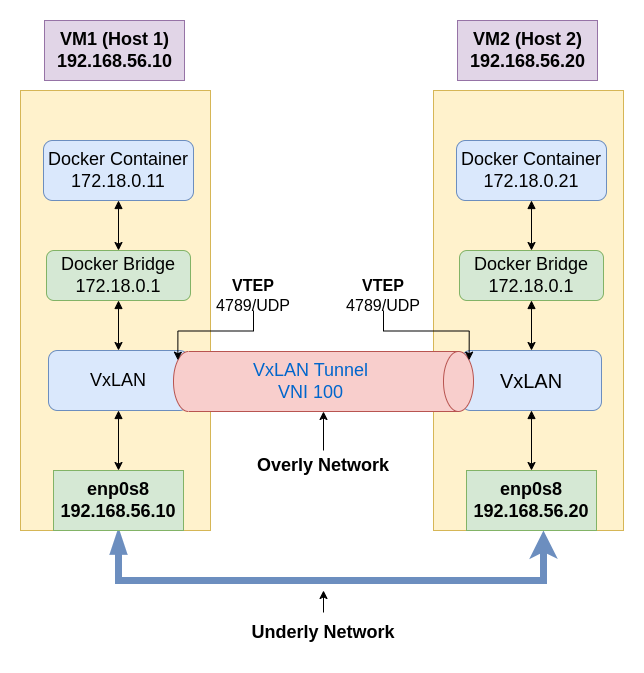

# Multi-Container Host Networking using VxLAN Overlay Networks

# Description
This project demonstrates how to set up multi-container host networking using VxLAN overlay networks. VxLAN (Virtual Extensible LAN) is a network virtualization technology that allows you to create virtual networks on top of an existing network infrastructure. It extends Layer 2 segments over a Layer 3 (IP) network, enabling communication between containers running on different hosts as if they were on the same local network.

## Blog Post for more details: [Link](https://medium.com/@masud.educations/multi-container-host-networking-using-vxlan-overlay-networks-bd29570b4ae0)


## Architecture



# Environment Setup
##  Host 1
IP: 192.168.56.10
## Host 2
IP: 192.168.56.20

# Steps
## Host 1
1. Initialize Vagrant and create a VM with Ubuntu Bionic64 image.
```
vagrant init ubuntu/bionic64
```
2. Halt the VM to assign an IP address (manually configured in the VirtualBox network settings).

3. Bring up the VM and SSH into it.
```
vagrant up
vagrant ssh
sudo -i
```
4. Install Docker on the VM.
```
sudo apt update
sudo apt install -y docker.io
```

5. Create a separate Docker bridge network called "vxlan-net" with the subnet 172.18.0.0/16.
```
sudo docker network create --subnet 172.18.0.0/16 vxlan-net
```
**Example Output:**
```
4c6851bb4479df47b6a86943e2ac044fafca1e6483a5b04d0ec37f37d1321806
```
6. List all networks in Docker to verify the "vxlan-net" creation.
```
docker network ls
```
Example Output:
```
NETWORK ID     NAME        DRIVER    SCOPE
a8fbc7ae74f4   bridge      bridge    local
231c6b346afa   host        host      local
beb0ae23e7fc   none        null      local
1e387e462b61   vxlan-net   bridge    local
```

7. Run a container with the IP address 172.18.0.11 on the "vxlan-net" network.
```
sudo docker run -d --net vxlan-net --ip 172.18.0.11 ubuntu sleep 3000
```
Example Output:
```
1f2f49dc3279de11dc547fc78fb8406f06312fd0fb75a6d1bf0280ff89590886
```
8. Check the IP address of the running container.
```
docker inspect 1f2f49dc3279 | grep IPAddress
```
Example Output:
```
"IPAddress": "172.18.0.11",
```
9. Enter the running container using exec and install necessary packages (net-tools and ping).
```
docker exec -it 1f2f49dc3279 bash
apt update
apt install net-tools
apt install iputils-ping
exit
```
10. Create a VxLAN tunnel on Host 1.
```
sudo ip link add vxlan-demo type vxlan id 100 remote 192.168.56.20 dstport 4789 dev enp0s8
```
11. Make the VxLAN interface up.
```
sudo ip link set vxlan-demo up
```
12. Attach the VxLAN interface to the Docker bridge.
```
brctl addif br-4c6851bb4479 vxlan-demo
```
13. Check the routing table to ensure everything is set up correctly.
```
route -n
```
Example Output:
```
Kernel IP routing table
Destination     Gateway         Genmask         Flags Metric Ref    Use Iface
...
172.18.0.0      0.0.0.0         255.255.0.0     U     0      0        0 vxlan-demo
```
14. Enter the running container again and ping the IP of the other container (on Host 2).
```
docker exec -it 1f2f49dc3279 bash
ping 172.18.0.20 -c 2
```
Example Output:
```
PING 172.18.0.20 (172.18.0.20) 56(84) bytes of data.
64 bytes from 172.18.0.20: icmp_seq=1 ttl=64 time=0.059 ms
64 bytes from 172.18.0.20: icmp_seq=2 ttl=64 time=0.050 ms

--- 172.18.0.20 ping statistics ---
2 packets transmitted, 2 received, 0% packet loss, time 1001ms
rtt min/avg/max/mdev = 0.050/0.054/0.059/0.004 ms
```


# Host 2

1. Initialize Vagrant and create a VM with Ubuntu Bionic64 image.
```
vagrant init ubuntu/bionic64
```
2. Halt the VM to assign an IP address (manually configured in the VirtualBox network settings).

3. Bring up the VM and SSH into it.
```
vagrant up
vagrant ssh
sudo -i
```
4. Install Docker on the VM.
```
sudo apt update
sudo apt install -y docker.io
```

5. Create a separate Docker bridge network called "vxlan-net" with the subnet 172.18.0.0/16.
```
sudo docker network create --subnet 172.18.0.0/16 vxlan-net
```
**Example Output:**
```
1e387e462b61a729b7efcaee868e4524e8f214bccc62e054c892eba4436b4aa7
```
6. List all networks in Docker to verify the "vxlan-net" creation.
```
docker network ls
```
Example Output:
```
NETWORK ID     NAME        DRIVER    SCOPE
071a9a3e7397   bridge      bridge    local
c73becfed0f2   host        host      local
f07aba40f963   none        null      local
4c6851bb4479   vxlan-net   bridge    local
```

7. Run a container with the IP address 172.18.0.20 on the "vxlan-net" network.
```
sudo docker run -d --net vxlan-net --ip 172.18.0.20 ubuntu sleep 3000
```
Example Output:
```
ec18a034496dabfabc13156c1a04184928c1e289dfe09a17230ad2858ad3f98a
```
8. Check the IP address of the running container.
```
docker inspect 1f2f49dc3279 | grep IPAddress
```
Example Output:
```
"IPAddress": "172.18.0.20",
```
9. Enter the running container using exec and install necessary packages (net-tools and ping).
```
docker exec -it 1f2f49dc3279 bash
apt update
apt install net-tools
apt install iputils-ping
exit
```
10. Create a VxLAN tunnel on Host 1.
```
sudo ip link add vxlan-demo type vxlan id 100 remote 192.168.56.10 dstport 4789 dev enp0s8
```
11. Make the VxLAN interface up.
```
sudo ip link set vxlan-demo up
```
12. Attach the VxLAN interface to the Docker bridge.
```
brctl addif br-1e387e462b61 vxlan-demo
```
13. Check the routing table to ensure everything is set up correctly.
```
route -n
```
Example Output:
```
Kernel IP routing table
Destination     Gateway         Genmask         Flags Metric Ref    Use Iface
...
172.18.0.0      0.0.0.0         255.255.0.0     U     0      0        0 vxlan-demo
```
14. Enter the running container again and ping the IP of the other container (on Host 2).
```
docker exec -it ec18a034496d bash
ping 172.18.0.11 -c 2
```
Example Output:
```
PING 172.18.0.11 (172.18.0.11) 56(84) bytes of data.
64 bytes from 172.18.0.11: icmp_seq=1 ttl=64 time=0.060 ms
64 bytes from 172.18.0.11: icmp_seq=2 ttl=64 time=0.047 ms

--- 172.18.0.11 ping statistics ---
2 packets transmitted, 2 received, 0% packet loss, time 1001ms
rtt min/avg/max/mdev = 0.047/0.053/0.060/0.007 ms
```

